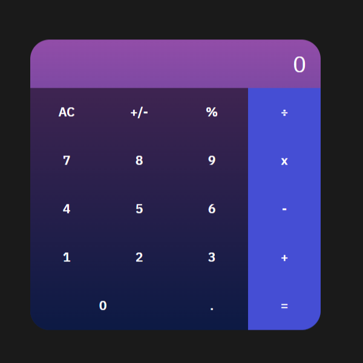

# Math Magicians

> "Math magicians" is a website for all fans of mathematics. It is a dark-themed Single Page App (SPA) that allows users to make simple calculations, and read a random math-related quote.

## Built With

- React

## Live Demo (coming soon)

[Live Demo Link](https://livedemo.com)

## Getting Started

To get a local copy up and running follow these simple example steps.

### Prerequisites
Install Node and npm on your computer.
### Setup
Clone this repository with git clone https://github.com/melaniesigrid/math-magicians.git in your terminal.
Navigate to the project directory, and run npm start.

## Author

👤 **Melanie Sigrid**

- GitHub: [@melaniesigrid](https://github.com/melaniesigrid)
- Twitter: [@SiriMoon11](https://twitter.com/SiriMoon11)
- LinkedIn: [LinkedIn](https://www.linkedin.com/in/melanie-arellano-92aaa9194/)

## 🤝 Contributing

Contributions, issues, and feature requests are welcome!

Feel free to check the [issues page](../../issues/).

## Show your support

Give a ⭐️ if you like this project!

## Acknowledgments

- Hat tip to all of my code reviewers and partners at Microverse!

## 📝 License

This project is [MIT](./MIT.md) licensed.
